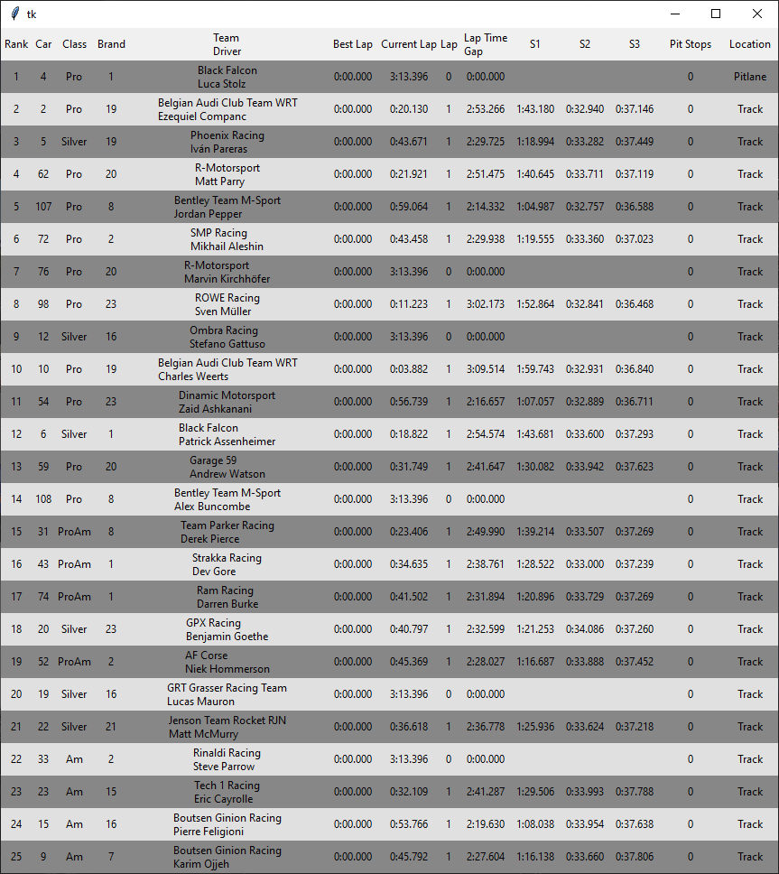

# PyAcc_leaderboard

## Usage

`phython main.py [-ip"X"] [-pX] [-debug]`

* no args will use local host and port 9000 to connect to the UDP interface
* `-debug` Log everything happening during the runtime
* `-ip"target ip"` Change default ip (local host) to the specified one (`" "` are mandatory, crash orther wise :flushed: ) *eg: python main.py -ip"192.168.1.2"*
* `-p"traget port"` Change default port (9000) to the specified one *eg: python main.py -p9000*

## Changelogs

### Version 0.6.2

* Add Manufacturer logos instead of showing car model id

### Version 0.6.1

* Fixed a case when decoding a bytes could fail
* Fixed a crash when using the app in a session with no time limit
* Fixed my incompetent writting ***again***
* Fixed a bug that could occure when writting an emoji
* Fixed a crash when reading acc messy unicode 😂 (like if a driver put an unicode emoji in his name)

### Version 0.6

* Added colored background to differentiate Pitlane (Red), PitEntry (Blue) and PitExit (Green)
* Fixed from_date_time() for more than 23h race
* Gui now update every 500ms (instead of 1000ms)
* Changed README.md
* Yes Version 0.6 changes are lame.

### Version 0.5

* Improved session info UI
* Added pit stop counter
* Replace print with the logging module
* Move byte writting function into the Cursor module
* Improved command line args

#### The new command line args

`phython main.py [-ip"X"] [-pX] [-log] [-debug]`

* `-log` Log basic information during the runtime
* `-debug` Log everything happening during the runtime
* `-ip"target ip"` Change default ip (local host) to the specified one (`" "` are mandatory, crash orther wise :flushed: )
* `-p"traget port"` Change default port (9000) to the specified one

### Version 0.4

* Major GUI redesing
* Add a font that doesn't looks like shit :joy:
* Clear GUI when entry list update is reveiced
* Fix bug when data send by the acc thread isn't complete during entry list update
* Fixed broken read_f32() function returning garbage value
* Add session information (time left, cloud cover, rain level, temps, ect) to app screen
* Add cute emoji to indicate car location (in pit or track)
* Changed some header title
* Updated accProtocol to get session information
* Plus other stuff that I already forgot ...

### Version 0.3

* Handle error and timeout, now even if the game is closed or the session is over the app **shouldn't** crash and wait to reconnect
* ACC worker thread handle socket stuff by itself
* Add window title (***very important***)
* Make print message cutier or uglier :grimacing:
* Added some comment may be if I'm not too lazy the code will be commented :joy:
* Make the first letter uppercase in the previous patch note because uppercase life matters :neckbeard:
* EMOJI EVERYWHERE !!! :smiling_imp: :blush:

### Version 0.2.1

* Added command line args for ip and port => `python main.py [ip] [port]`, no args will use localhost and port 9000

### Version 0.2

* I still don't know what I'm doing with threads, but it should :tm: be better
* Bug fixes
* Fixed bug added by the bug fix
* New GUI theme to make the eyes suffer less
* Removed nords for sanity

### Version 0.1

* Idk what I'm doing with thread, plz don't @me
* It might dead lock
* It might crash the game (:
* At least the basic work
* Added nords <3
