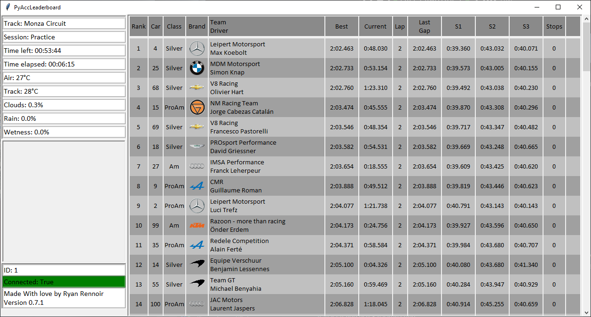

# PyAcc_leaderboard

## Version 0.2.1
* Added command line args for ip and port => `python main.py [ip] [port]`, no args will use localhost and port 9000

## Version 0.2
* I still don't know what I'm doing with threads, but it should :tm: be better
* bug fixes
* fixed bug added by the bug fix
* new GUI theme to make eyes suffer less
* removed nords form sanity

## Version 0.1
* idk what I'm doing with thread, plz don't @me
* It might dead lock
* It might crash the game (:
* at least the basic work
* added nords <3